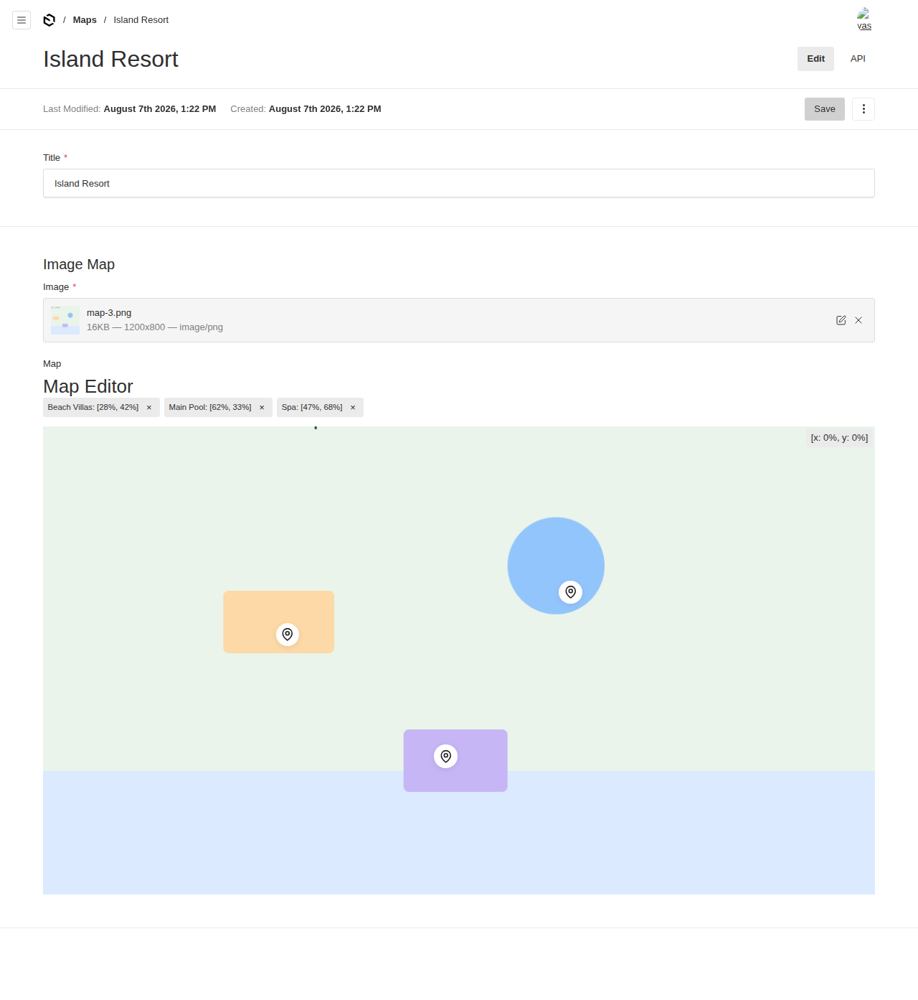

# @foundrykit/image-map-field

An interactive **image-map** field for [Payload CMS 3](https://payloadcms.com). Editors upload a base image (a site plan, floor plan, map, product photo, diagram…) then click to drop positioned **waypoints/pins**, name them, and attach content, a link or an icon type. Pins are stored as percentage coordinates, so they stay correct at any display size.

Extracted from the Turquoise "journey map" feature and generalised: the editor now writes straight to the Payload field (no bespoke API endpoint or page coupling), and the base-image collection is configurable.

## Features

- **Click-to-place pins** on any uploaded image; drag-free, percentage-based coordinates.
- **Right-click a pin** to edit or delete it (radix context menu); a popover names new pins.
- **Rich waypoint data** — name, content, optional type (icon key), link + link text, and an image per pin — edited in a dialog.
- **Live coordinate readout** and a removable chip list of all pins.
- **Writes through the field** — pin edits go straight to the `map` JSON value via Payload's `useField`, persisted on save. No custom route, no `page` prop.
- **Configurable media collection** — defaults to `media`, override with `mediaSlug`.

## Screenshot

Base image with three positioned pins (Beach Villas, Main Pool, Spa), each editable/removable:



---

## Installation

```sh
pnpm add @foundrykit/image-map-field
```

Peer deps: `payload`, `@payloadcms/ui`, `react`. Radix UI and `lucide-react` ship as dependencies.

Run `payload generate:importmap` so the editor component is registered (automatic on dev/build).

## Usage

```ts
import { imageMap } from '@foundrykit/image-map-field'
import type { CollectionConfig } from 'payload'

export const Maps: CollectionConfig = {
  slug: 'maps',
  fields: [
    { name: 'title', type: 'text', required: true },
    imageMap(),                                  // group: { image (upload), map (json) }
    // or: imageMap({ name: 'floorPlan', mediaSlug: 'assets', required: false })
  ],
}
```

`imageMap()` returns a group field with:

- `image` — an `upload` to your media collection (the base image),
- `map` — a `json` value `{ waypoints: Waypoint[] }`, rendered by the editor.

```ts
type Waypoint = {
  id: string
  x: number      // 0–100 (% of image width)
  y: number      // 0–100 (% of image height)
  name: string
  type?: string      // optional category / icon key
  content?: string
  link?: string
  linkText?: string
  image?: string
}
```

### Rendering on the frontend

The value is plain JSON, so rendering is up to you — absolutely position each pin using its `x`/`y` percentages over the same image:

```tsx
{waypoints.map((w) => (
  <button key={w.id} style={{ position: 'absolute', left: `${w.x}%`, top: `${w.y}%` }}>
    {w.name}
  </button>
))}
```

## Options

```ts
imageMap({
  name?: string        // group field name, default 'imageMap'
  mediaSlug?: string   // upload collection for the base image, default 'media'
  required?: boolean   // is the base image required, default true
  overrides?: Partial<GroupField>  // deep-merged onto the generated group
})
```

## Exports

- `@foundrykit/image-map-field` — `imageMap`, the `Waypoint` type.
- `@foundrykit/image-map-field/client` — `ImageMapField`, `MapEditor` (registered via the import map).

## Development

```sh
pnpm install
pnpm dev          # dev admin at http://localhost:3000/admin — a seeded "Island Resort" map
pnpm test         # unit + integration + e2e
pnpm test:unit    # field factory shape + options
pnpm test:int     # group registration + waypoint round-trip on a real Payload instance
pnpm build && pnpm verify:pack
```

The editor's styles ship as SCSS (compiled by your Payload admin build, like Payload's own components).

## License

MIT © Isaac SJ / Umi
